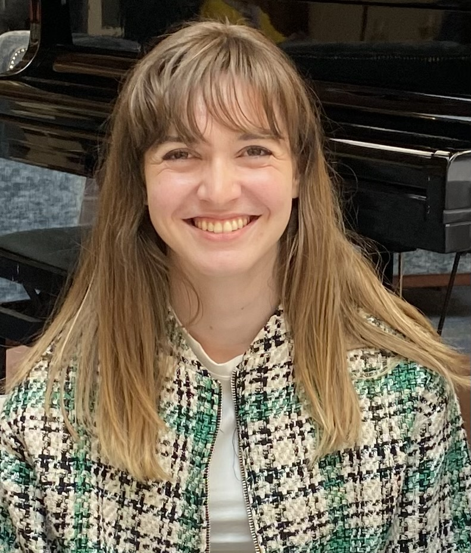

---
---

Hi! I'm Claire. I am a PhD candidate in NLP at the University of Edinburgh, supervised by [Michael Rovatsos](https://www.ed.ac.uk/profile/prof-michael-rovatsos) and [Nehal Bhuta](https://www.law.ed.ac.uk/people/professor-nehal-bhuta) and a Bloomberg PhD Fellow. As part of EdinburghNLP, I have an ongoing collaboration with [Pasquale Minervini](http://www.neuralnoise.com/). I am also affiliated with the [Centre for Technomoral Futures](https://www.technomoralfutures.uk/). I am interested in topics in information extraction, indirectly supervised learning, domain-specific language models and fairness for NLP. During my PhD project, I am working on advancing legal information extraction with a specific focus on designing and implementing NLP-based functionalities in the legal workflow to inform, speed up and improve the transparency of the refugee claim process. 

Before starting my PhD, I worked as a financial analyst and studied at Paris Dauphine University. I have a background in economics and finance, and graduated with a masters of research in computer science in 2021 with a project on generating fairness through explanations in decision making. 

||||
|-- |:----: |-- |
||[Google Scholar](https://scholar.google.com/citations?user=oAqjTukAAAAJ&hl) \| [Twitter](https://twitter.com/clairebarale) \| [Linkedin](https://www.linkedin.com/in/claire-barale-leandri/) \| [Email](mailto:claire.barale@ed.ac.uk) ||            

---

## News

* November 27th 2023, NYC, I will be co-organizing a workshop on NLPxFinance at the 4th ACM Conference on AI in Finance - [NLP and Network Analysis in Financial Applications](https://sites.google.com/view/nlp-na-in-finance-2023/home). Deadline for submission coming soon, November 10th! 
* October 2023, 2 papers accepted at the NLLP workshop, EMNLP 2023! I will present them on December, 7th in Singapore
* October 2023, I will present my work at the Women in HPC workshop hosted at SC2023, Denver, CO
* July 2023, I'm very happy to announce that I received the Bloomberg Data Science Ph.D. Fellowship
* July 2023, Our paper presenting a new information extraction pipeline for legal documents was published in ACL Findings
* June 2023, I received the Best Doctoral Consortium Paper Award at ICAIL 2023

---

## Research and Publications

**Do Language Models Learn about Legal Entity Types during Pretraining?**\
Claire Barale, Michael Rovatsos, Nehal Bhuta\
Proceedings of the 4th Natural Legal Language Processing Workshop (NLLP) at EMNLP 2023 | [link to the paper](https://arxiv.org/abs/2310.13092)

**AsyLex: A Dataset for Legal Language Processing of Refugee Claims**\
Claire Barale, Mark Klaisoongnoen, Pasquale Minervini, Michael Rovatsos and Nehal Bhuta\
Proceedings of the 4th Natural Legal Language Processing Workshop (NLLP) at EMNLP 2023 |  

**Automated Refugee Case Analysis: A NLP Pipeline for Supporting Legal Practitioners**\
Claire Barale, Michael Rovatsos, and Nehal Bhuta\
ACL Findings 2023 | [link to the paper](https://aclanthology.org/2023.findings-acl.187/)

**fAsyLex: Accelerating Legal NLP through Comparative Analysis of Multi-GPU Approaches**\
Claire Barale\
Women in High Performance Computing Workshop (WHPC) at SC2023 | [slides]("/docs/whpc_fasylex_slides.pdf)

**Empowering Refugee Claimants and their Lawyers: Using Machine Learning to Examine Decision-Making in Refugee Law**\
Claire Barale\
International Conference on Artificial Intelligence and Law (ICAIL) 2023, Doctoral Consortium, **Best Paper Award** | [link to the paper](https://arxiv.org/abs/2308.11531)

**Human-Centered Computing in Legal NLP - An Application to Refugee Status Determination**\
Claire Barale\
Second Workshop on Bridging Human–Computer Interaction and Natural Language Processing at NAACL 2022 | [link to the paper](https://aclanthology.org/2022.hcinlp-1.4/)

**Refugee status determination: how cooperation with machine learning tools can lead to more justice**\
Claire Barale\
Scottish Law and Innovation Network (SCOTLIN) Early Career Scholars Symposium 2022 | [link to the paper](https://arxiv.org/abs/2308.11541)

**What is fair data manipulation?**\
Alexis Tsoukias, Claire Barale\
European Conference on Operational Research, 2021 | [link to the paper](https://www.euro-online.org/conferences/program/#abstract/913)

**Explanations in decision support – Generating Fairness through explanations**\
Claire Barale\
PSL Université Paris Dauphine, Paris. Masters of Research Dissertation, 2021

---
