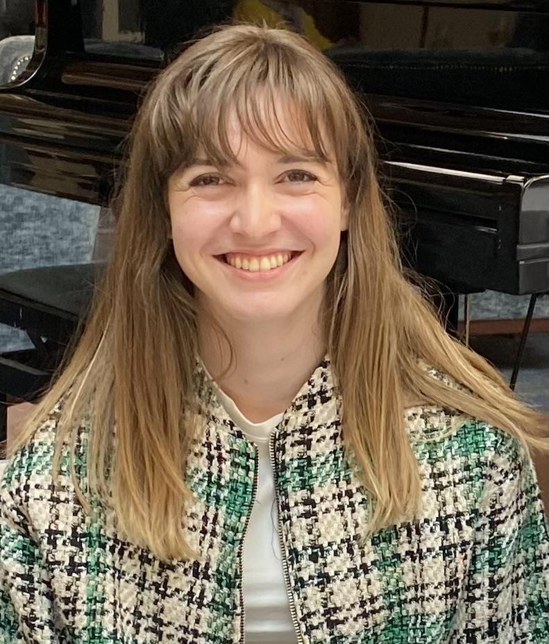

---
---

I am a postdoc at the University of Copenhagen. I completed my PhD in NLP at the University of Edinburgh, supervised by [Michael Rovatsos](https://edwebprofiles.ed.ac.uk/profile/prof-michael-rovatsos). My PhD was supported by a Bloomberg Data Science PhD Fellowship. I spent time at Bloomberg as a research intern working on legal language modeling, and as a research engineer working on natural language understanding and agentic systems. 

I am interested in understanding language models and their behavior when faced with non-standard language and registers like legal language.   

Before all that, I completed a master's of research in computer science from Paris Dauphine and École des mines de Paris, during which I was a research assistant advised by [Alexis Tsoukias](https://dauphine.psl.eu/recherche/cvtheque/profil/tsoukias-alexis) in the [LAMSADE lab](https://www.lamsade.dauphine.fr/en.html). I was born and grew up in Nice, France.

||||
|-- |:----: |-- |
||[Google Scholar](https://scholar.google.com/citations?user=oAqjTukAAAAJ&hl) \| [Twitter](https://twitter.com/clairebarale) \| [Linkedin](https://www.linkedin.com/in/claire-barale-leandri/) \| Email: claire.barale (at) di.ku.dk||            

---

## News
* Started my postdoc at the University of Copenhagen
* July 2026: I will be a panelist at the [AI for Law workshop at ICML](https://sites.google.com/view/ai4law-icml2026). 
* June 2026: I have been awarded my PhD degree!
* January 2026: I passed my viva with minor corrections. Thanks to the examiners: Simone Teufel, Nikos Aletras and Adam Lopez.
* November 2025: Started working at Bloomberg AI in London
* August 2025: Our paper LexTime: A Benchmark for Temporal Ordering of Legal Events, has been accepted at EMNLP Findings. We will also present it at the XTempLLMs workshop hosted at COLM. 
* May 2025: Our paper on Faithfulness and Content Selection in Summarisation has been accepted at ICAIL
* January 2025: [Are we done with MMLU?](https://arxiv.org/abs/2406.04127#:~:text=Maybe%20not.,the%20true%20capabilities%20of%20LLMs.), our paper presenting MMLU-Redux will be at NAACL 2025 
* October 2024: Our paper Information Extraction for Planning Court Cases  was accepted to NLLP 2024 (hosted at EMNLP)
* April 2024: Consider attending/submitting to [BAIPsy 2024](https://xuerli.github.io/BAIPSY/), a student workshop that aims to faciliate discussion and exchange between Artificial Intelligence and Psychology researchers.
* From May to August 2024, I will be interning at Bloomberg (CTO office) in New York, focusing on information extraction in the legal domain. 
* November 27th 2023, NYC, I will be co-organizing a workshop on NLPxFinance at the 4th ACM Conference on AI in Finance - [NLP and Network Analysis in Financial Applications](https://sites.google.com/view/nlp-na-in-finance-2023/home). Deadline for submission coming soon, November 10th! 
* October 2023, 2 papers accepted at the NLLP workshop, EMNLP 2023! I will present them on December, 7th in Singapore
* October 2023, I will present my work at the Women in HPC workshop hosted at SC2023, Denver, CO
* July 2023, I'm very happy to announce that [I received the Bloomberg Data Science Ph.D. Fellowship](https://www.bloomberg.com/company/stories/introducing-the-sixth-cohort-of-bloomberg-data-science-ph-d-fellows-2023-2024/)
* July 2023, Our paper presenting a new information extraction pipeline for legal documents was published in ACL Findings
* June 2023, I received the Best Doctoral Consortium Paper Award at ICAIL 2023

